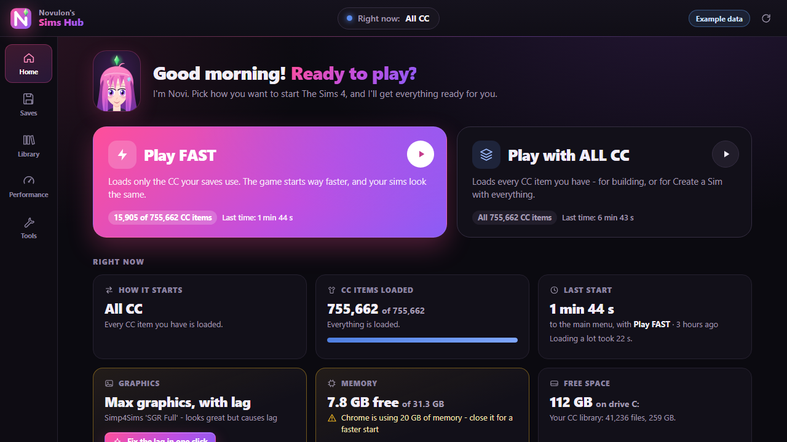

  

  
  
  
  

 

<table>
<tr>
<td width="50%" valign="top">

### Wicked Animator

Make WickedWhims animations without Blender. Pose your sims, build the motion on a timeline, add sounds, and send it
straight into your game.

</td>
<td width="50%" valign="top">

### Sims Hub

Load the game faster and play with less lag. The Hub starts The Sims 4 with only the custom content your saves use,
and keeps your Mods folder tidy.

</td>
</tr>
</table>

## Wicked Animator

A full animation studio built for WickedWhims, designed for players rather than 3D artists.

- **Pose by dragging.** Move a hand or foot and the body follows, with optional natural limits for every joint.
- **Faces and hands.** Expressions, eye direction, lip-sync, and ready-made hand shapes.
- **Timeline.** Keyframes, easing curves, ghost frames, motion trails and tools for seamless loops.
- **Automatic motion.** Physics, sims holding each other, and furniture from the game at the correct scale.
- **Copy real movement** from a video or your webcam.
- **Sound.** Game voices, creator sounds, or your own audio files.
- **One-click export** to the game, or package several animations as a mod to share.

Requires the WickedWhims mod. For adults (18+).

## Sims Hub

  

- **Faster loading.** Start the game with only the CC your saves use. Nothing is deleted; the rest is set aside for
  that session only.
- **Less lag, same graphics.** Fixes the settings that slow the game down while keeping maximum quality.
- **Tidy downloads.** New downloads are sorted and merged automatically; script mods are never touched.
- **Duplicate cleaner.** Finds identical copies of CC and checks the game still loads exactly the same content.
- **Safe by design.** Every change can be undone, and nothing changes while the game is running.

## Installation

1. Download the app you want using the buttons above.
2. Open the downloaded file.
3. On first start the app installs itself, adds Desktop and Start Menu shortcuts, and sets up everything it needs,
   including Python and Microsoft Edge WebView2 if they are missing. This takes a minute or two.

**Requirements:** Windows 10 or 11 (64-bit), The Sims 4 on PC, and an internet connection for the first start.

## Updates

The apps update themselves. Each time you open one, it checks this repository for a newer version and installs it
before starting. Your animations, poses, saves and settings are never touched by an update.

## Safety

- **Built in the open.** Every download is compiled from the code in this repository by
  [GitHub Actions](https://github.com/xNovulon/SimsHub/actions/workflows/build-apps.yml), and each file has a
  published SHA-256 checksum on the [release page](https://github.com/xNovulon/SimsHub/releases/tag/apps).
- **Runs on your PC.** The apps only go online to check for updates and to download what they need to run.
- **Windows SmartScreen.** Because the apps are not code-signed, Windows may show "Windows protected your PC" the first
  time. Select **More info**, then **Run anyway**.

## Support

If something doesn't work, each app keeps logs you can include in a report:

| App | Log folder |
| --- | --- |
| Wicked Animator | `%LOCALAPPDATA%\NovulonWickedAnimator` |
| Sims Hub | `%LOCALAPPDATA%\NovulonSimsHub` |

Paste the path into the File Explorer address bar to open it, then
[open an issue](https://github.com/xNovulon/SimsHub/issues/new) describing what happened.

<b>For developers</b>

 

| Folder | Contents |
| --- | --- |
| `wicked_animator/` | Python engine (`backend/`), web interface (`web/`), Windows app (`desktop/`), checks (`tools/`) |
| `sims_hub/` | Python engine (`speedkit/`, interface in `speedkit/hub/`), in-game mod (`ingame/`), Windows app (`desktop/`), tests |
| `shared/desktop/` | Code both Windows apps share: installing, updating, Python and WebView2 setup, the splash screen |

- **Releasing:** push to `main`. Installed apps pick up changed files the next time they open. Changes to a
  `desktop/` folder trigger a new build on the [apps release](https://github.com/xNovulon/SimsHub/releases/tag/apps),
  and installed apps replace themselves with it.
- **What users receive:** each app's folder, excluding files only developers need (`desktop/`, `tools/`, `tests/`,
  `research/`, `docs/`, `branding/`). The lists are in each app's `desktop/Program.cs`.
- **Local work:** a `git clone` never updates itself. Build an app with `desktop\build.ps1`, or run an engine directly
  (`python backend\server.py`, `python -m speedkit.hub`). Set `WICKED_NO_UPDATE=1` or `SIMS_HUB_NO_UPDATE=1` to turn
  updates off.

---

Novulon's apps are fan-made and are not affiliated with or endorsed by Electronic Arts, Maxis or TURBODRIVER.
The Sims is a trademark of Electronic Arts Inc. WickedWhims is created by TURBODRIVER.
