

  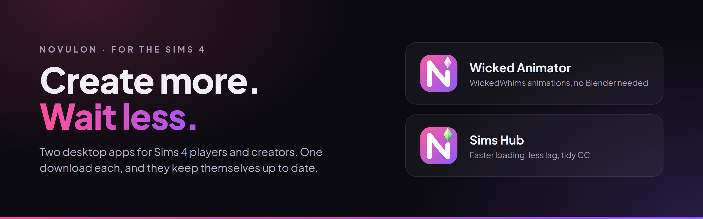

  
  &nbsp;
  

Two free Windows apps for people who play The Sims 4 with a lot of mods.

**Sims Hub** is for everyday playing: it gets the game to the main menu faster, fixes lag without making it look worse,
and helps you keep a big pile of CC tidy. **Wicked Animator** is for making your own WickedWhims animations, without
learning Blender.

You can use either one on its own. Each is a single download that sets itself up and keeps itself up to date.

 

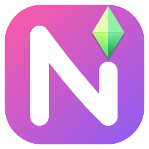

## Sims Hub

Faster loading, less lag, and a clear view of all your CC.

 

  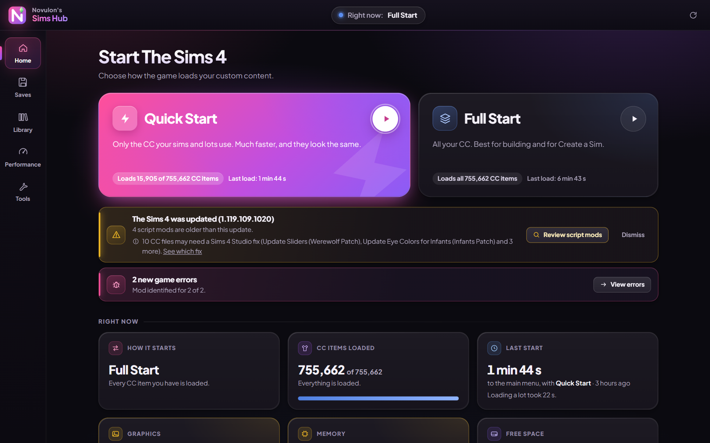

### Why the game loads faster

The Sims 4 reads every CC file you have each time it starts, even the ones none of your sims wear. With thousands of
files that can take many minutes.

**Quick Start** looks at your saves and your in-game library, works out which CC is actually used, and starts the game
with just that. Your sims and lots look exactly the same, and the game gets to the main menu in a fraction of the time.
The rest of your CC isn't deleted. It's moved to a side folder (`Mods_parked`, right next to your Mods folder) for
that session and comes back the moment you pick **Full Start**, which loads everything for building and browsing in
Create a Sim.

A simple way to use it: pick **Quick Start** when you just want to play, and **Full Start** when you want to make a
new sim or build with all your CC.

The Hub times every start, so you can see how much time you're saving.

<table>
<tr>
<td width="50%" valign="top">

### Your whole CC library, with pictures

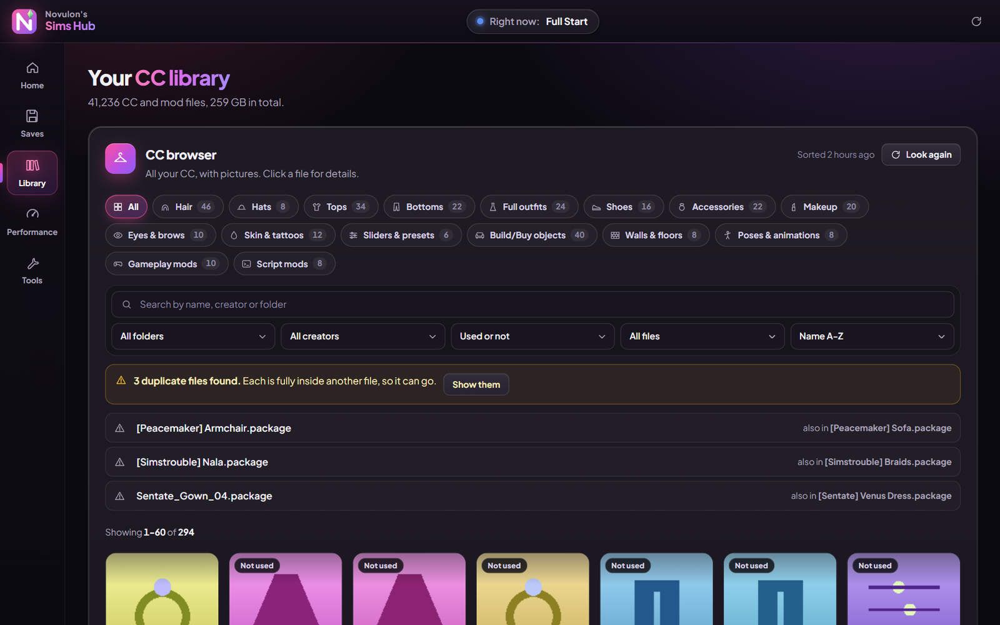

Every CC file you have, sorted into hair, tops, shoes, makeup, Build/Buy and more, each with its picture. Search by
name, creator or folder, and find CC that none of your saves use.

If a file is an exact copy of something another file already has, the Hub tells you which one, so you know it's safe
to remove. Merged files can be split back into the files that went into them.

</td>
<td width="50%" valign="top">

### Play one save

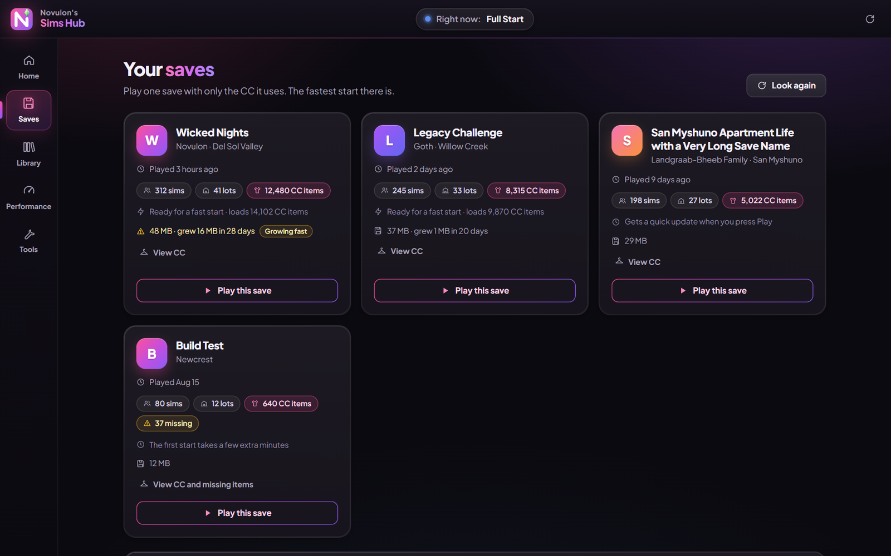

Start a single save with only the CC that save needs, which is the fastest start there is. You can also see which CC
each save uses, what's missing from it, and which saves are getting big.

Backups of your saves go in a folder the game never reads, and one is made automatically before the Hub changes
anything after a game update. Restoring one is a single click.

</td>
</tr>
<tr>
<td width="50%" valign="top">

### Less lag, same graphics

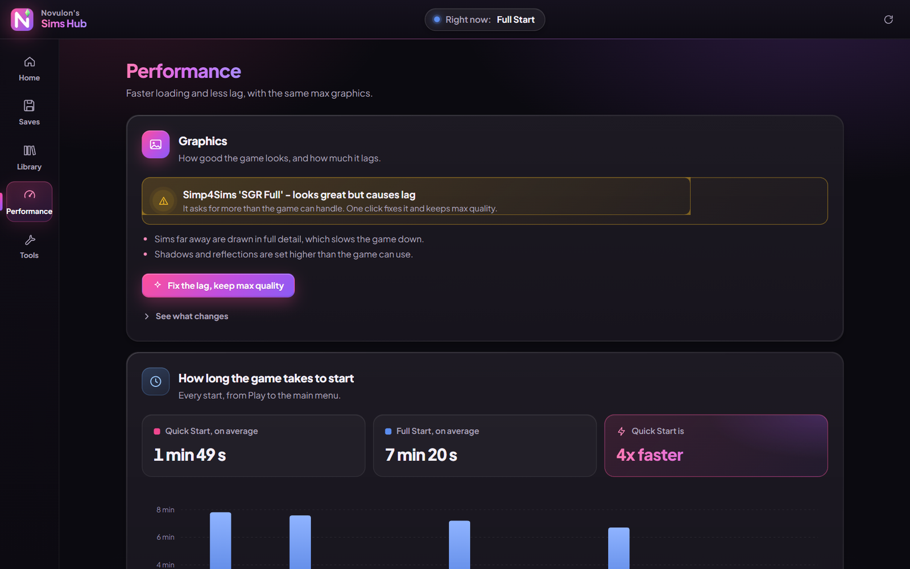

Popular graphics setups often ask for more than the game can handle, like drawing far-away sims in full detail. The Hub
turns down only those settings, so the game still looks like max graphics but runs smoother.

There's also a lag meter you can run inside the game. It names the mods that slow your game down the most.

</td>
<td width="50%" valign="top">

### Fix problems quickly

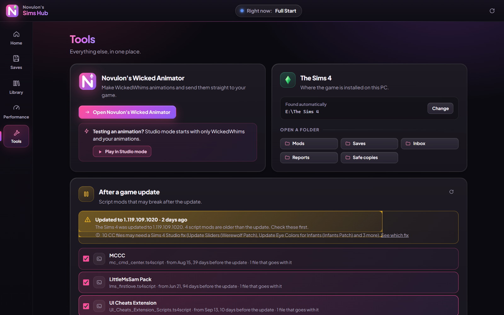

After a game update, the Hub lists the script mods that are older than the update, since those are the ones most
likely to break. When the game writes an error, the Hub reads it and tells you which mod caused it. It also finds CC
that needs a Sims 4 Studio batch fix and tells you which fix to run.

</td>
</tr>
</table>

### More it can do

- **Clean up duplicates.** Removes identical copies of the same CC, including copies hidden inside merged files. Your
  game shows exactly the same CC afterwards, just with less to load.
- **Unmerge.** Splits a merged file back into the original files. Works on merges made with Sims 4 Studio, Sims 4 Mod
  Manager or the Hub.
- **Add new downloads.** Put new CC and mods in one folder and press a button. The Hub puts everything in the right
  place and merges CC so the game has fewer files to open. Script mods are never merged or changed.

### Is it safe?

The Hub never deletes your files. Anything it removes goes to a safe folder first, and the **Undo last change** button
puts it back. It won't change anything while the game is running, and clean-ups like removing duplicates are checked
afterwards to make sure the game still loads exactly the same CC as before.

 

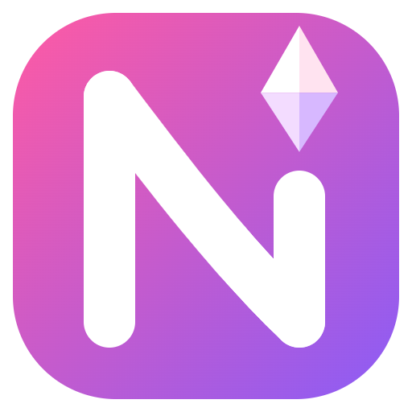

## Wicked Animator

Make WickedWhims animations without Blender, then send them straight into your game.

 

  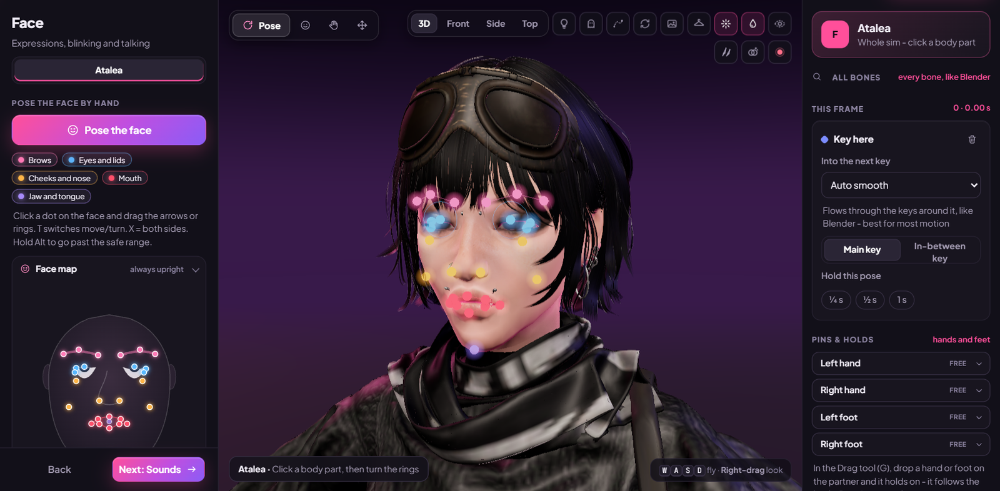

### How making an animation works

The app walks you through eight steps. You can jump between them at any time.

1. **Scene.** Add your sims and pick where it happens: the floor, a bed, a sofa and many more.
2. **Pose.** Start from a ready-made pose, or drag hands and feet and let the body follow.
3. **Motion.** Add movement with one click, or set your own keys on the timeline.
4. **Body.** Physics, hair and clothes to check clipping, and body details like the erection and the tongue.
5. **Face.** Ready expressions, blinking and lip-sync, or pose the brows, eyes and lips yourself.
6. **Sounds.** Game sounds, sounds made by other creators, or your own audio files.
7. **Details.** The name, the creator and where it can be played in the game.
8. **Share.** Send it to your game, or package it as a mod to share with others.

<table>
<tr>
<td width="62%" valign="top">

### Your own sims, as they look in the game

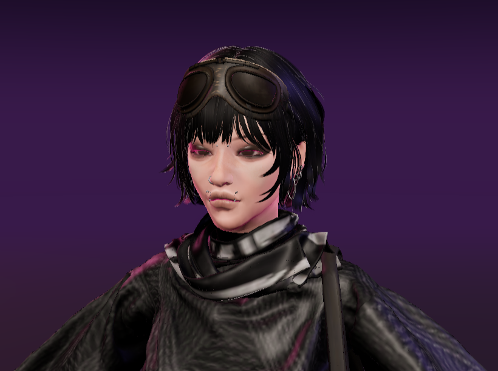

Load any sim from your saved library with their body shape, skin, makeup, tattoos, hair, outfit and accessories, so
you can see how the animation will look on them.

</td>
<td width="38%" valign="top">

### Every piece of their outfit

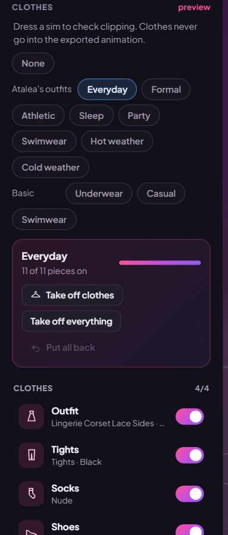

See each piece a sim is wearing, and take pieces off one at a time or all at once.

</td>
</tr>
</table>

### Tools that save you time

- **Magic Animation.** Pick a position and a place, and you get a finished, moving animation with sound in one click.
  Change anything you like from there.
- **Say it.** Type a sentence describing what should happen, and the app builds it for you.
- **Copy real movement.** Film yourself, use your webcam, or load a motion-capture file, and a sim copies the movement.
- **Posing that behaves.** Joints stay within natural limits, a hand can hold on to the other sim and follow them, and
  you can select several body parts and move them together.
- **Smooth loops.** Easing curves, ghost frames, motion trails and tools to make a loop join up without a jump.

### Your first animation in a few minutes

1. Open Wicked Animator and click **Magic Animation** on the home screen.
2. Pick a position, where it happens and how fast it should be, then press **Make it**. Both sims are posed and
   moving, with sounds.
3. Play it and change whatever you like: drag a hand, move a key on the timeline, add voices in the Sounds step.
4. Give it a name in the Details step.
5. Press **Send to game**, then start The Sims 4. It's in WickedWhims with your other animations.

When you want more control, start with **Blank animation** instead and build it pose by pose.

### Getting it into the game

Press **Send to game** and the animation is written into your Mods folder as a WickedWhims animation, ready the next
time you start the game. Before it's sent, the app checks for common problems, like a missing name or a sim without a
pose, so you find out in the app instead of in the game. The **Check my game** tool on the home screen also looks
through your Mods and WickedWhims settings when an animation doesn't show up.

Requires the WickedWhims mod. For adults (18+).

 

## Getting started

1. Download the app you want with the buttons at the top, and open the file.
2. The first start sets everything up and adds a desktop shortcut. This takes a minute or two.
3. That's it. The app updates itself whenever you open it, and your saves, animations and settings are kept.

If Windows says "Windows protected your PC", click **More info**, then **Run anyway**. It shows that for most apps made
by independent creators.

**You'll need:** Windows 10 or 11 (64-bit) and The Sims 4 on PC.

## Questions people ask

#### Does the game need to be running?

No, and it's better if it isn't. The Hub only changes your Mods folder while the game is closed. Wicked Animator
doesn't need the game running either, but The Sims 4 has to be installed, because the app uses the game's own bodies
and sounds.

#### Can the Hub break or delete my CC?

It never deletes anything. Quick Start only moves unused CC aside, clean-ups move files to a safe-keeping folder, and
**Undo last change** puts everything back the way it was. Script mods are never merged or changed.

#### Why doesn't Create a Sim show all my CC?

You're probably in Quick Start, which only loads the CC your saves use. Close the game and start it again with
**Full Start** to get everything.

#### My animation doesn't show up in the game

Check that WickedWhims is installed and up to date, and that mods are turned on in the game (Game Options, Other:
Enable Custom Content and Mods, and Script Mods Allowed). Then open **Check my game** on Wicked Animator's home
screen. It looks through your Mods folder and your WickedWhims settings and tells you what's in the way.

#### Can I share what I make?

Yes. In the Share step, press **Export a mod**. You get one file you can upload anywhere, and other players only need
WickedWhims to use it. You can put several animations in one mod.

#### Can I use the sims from my game?

Yes. Any adult sim saved to your in-game Library can be loaded into Wicked Animator with their own look.

#### How do updates work?

Each time you open an app, it checks for a newer version and updates itself before it starts. Updates never touch
your saves, your animations or your settings.

#### Do I need to install anything else?

No. The first start sets up what the app needs. If your PC doesn't have Python yet, the app installs it for your
Windows user only, so you don't need administrator rights.

## Where your files are

| What | Folder |
|---|---|
| CC set aside by Quick Start | `Documents\Electronic Arts\The Sims 4\Mods_parked` |
| Save backups made by the Hub | `Documents\Electronic Arts\The Sims 4\SpeedKit\save_backups` |
| Files set aside by clean-ups | `Documents\Electronic Arts\The Sims 4\SpeedKit` (or a `SpeedKit Quarantine` folder on another drive when space is low) |
| Animations sent to the game | `Documents\Electronic Arts\The Sims 4\Mods\FitStudio\MyAnimations` |
| Your animation projects | `Documents\Electronic Arts\The Sims 4\saves\FitStudio` |
| Animations packaged for sharing | `Documents\Wicked Animator Exports` |
| The apps themselves | `Tools\sims4_speedkit` and `Tools\sims4_animator` in your user folder |

## Removing an app

If you use Quick Start, open the Hub and pick **Full Start** once first, so all your CC is back in Mods. Then delete
the app's folder (see above) and its desktop shortcut. Your saves, CC and animations stay where they are.

## Something not working?

[Open an issue](https://github.com/xNovulon/SimsHub/issues/new) and describe what happened. Screenshots help a lot.

---

Novulon's apps are fan-made and are not affiliated with or endorsed by Electronic Arts, Maxis or TURBODRIVER.
The Sims is a trademark of Electronic Arts Inc. WickedWhims is created by TURBODRIVER.
